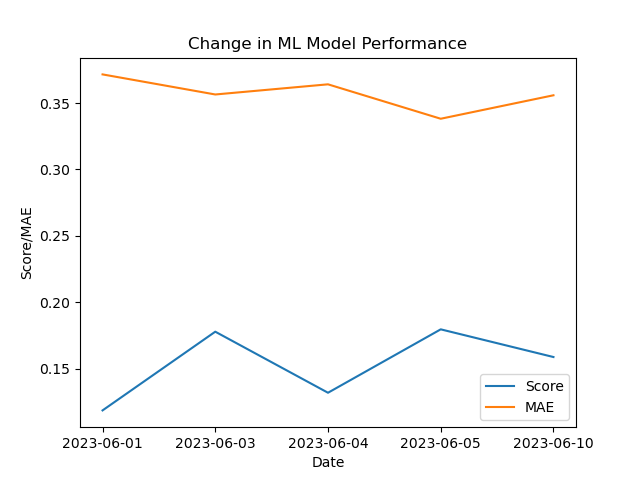

<h1 align='center'>Lithuanian Football League Match Result Predictor</h1>
<h3 align='center'>Orestas Dulinskas</h3>
<h4 align='center'>June 2023</h4>

## Overview

The Lithuanian Football League Match Result Predictor is a machine learning project that aims to predict the outcomes of matches in the Lithuanian football league, specifically the 'Optibet A lyga'. The project includes a prediction model and an API for accessing the predictions. Additionally, it features an end-to-end pipeline that enables weekly model retraining based on the latest match results.

## Table of contents

- [Requirements](#requirements)
- [Installation](#installation)
  - [1. Download and install Miniconda](#1-download-and-install-miniconda)
  - [2. Clone the project and set up the environment](#2-clone-the-project-and-set-up-the-environment)
  - [3. Set up Weights and Biases authorization](#3-set-up-weights-and-biases-authorization)
- [Usage](#usage)
  - [API](#api)
    - [Input](#input)
    - [Output](#output)
  - [Retrain Model](#retrain-model)
- [Pipeline](#pipeline)
  - [1. Data Scrape](#1-data-scrape)
  - [2. Pre-processing](#2-pre-processing)
  - [3. Data Testing](#3-data-testing)
  - [4. Data Segregation](#4-data-segregation)
  - [5. Training and Validation](#5-training-and-validation)
  - [6. Model Testing](#6-model-testing)
  - [7. Tour Prediction Evaluations and Next Tour Predictions](#7-tour-prediction-evaluations-and-next-tour-predictions)
- [Deployment on AWS EC2](#Deployment-on-AWS-EC2)
- [Contact](#contact)

## Requirements

The project requires Python 3.10.4 running on Ubuntu OS. It utilizes the latest version of Miniconda for environment management. Once all dependencies are installed, the project occupies approximately 45 GB of storage.

## Installation

To install the project, follow these steps:

### 1. Download and install Miniconda

```bash
> wget https://repo.anaconda.com/miniconda/Miniconda3-latest-Linux-x86_64.sh
> chmod u+x Miniconda3-latest-Linux-x86_64.sh
> ./Miniconda3-latest-Linux-x86_64.sh -b
```

### 2. Clone the project and set-up the environment

Clone the project repository from `https://github.com/Orestas41/lithuanian-football-league-predictor.git` by clicking on the 'Fork' button in the upper right corner. This will create a forked copy of the repository under your GitHub account. Clone the repository to your local machine:

```bash
> git clone https://github.com/[your github username]/lithuanian-football-league-predictor.git
> cd lithuanian-football-league-predictor
> conda env create -f environment.yml
> conda activate project-FootballPredict
```

### 3. Set-up Weights and Biases authorisation

To run the pipeline successfully, you need to set up authorization for Weights & Biases (WandB). W&B is a machine learning development platform that enables real-time tracking and visualization of various aspects of the model training process. Obtain your API key from W&B by visiting https://wandb.ai/authorize and clicking on the '+' icon to copy the key to the clipboard. Then, use the following command to authenticate:

```bash
> wandb login [your API key]
```

## Usage

### API

To launch the FastAPI locally, navigate to the root directory and run the following command:

```bash
> uvicorn predict:app
```

The API will be available at http://127.0.0.1:8000/predict

#### Input

The API accepts a POST request in JSON format with the following structure:

```bash
{
  "Home": "Šiauliai",
  "Away": "Džiugas"
}
```

#### Output

The API will return a response in the form of a string, providing the predicted outcome of the match:

```bash
"Šiauliai has a chance of 81.0% to win against Džiugas"
```

### Retrain model

To train or retrain the model, navigate to the root directory and run the following command:

```bash
> mlflow run .
```

The pipeline will scrape the latest match results from https://alyga.lt/rezultatai/1, merge them with the existing data, and perform model retraining from scratch. If the new model outperforms the previous versions based on metrics such as R-squared score and Mean Absolute Error (MAE), it will be promoted for use in the API.

## Reports

The pipeline generates various metrics to track model performance and logs pipeline steps to track the pipeline is running accordingly

- Ingested files: The reports are generated with the date of the run as the file name. It lists all the data files that were used during the run to train the model.
- Logs: This report is generated with the date of the run as the file name. It lists all the detailed steps in the pipeline run to track it and trace back the issue in case of an error.
- Predictions for the next tour: This report writes the predictions for the match result in the upcoming tour. Each prediction looks like this: `For the match between Banga and Sūduva, model predicts that Banga's chance of winning is 75%.`
- Model performance: New model performance metric (r2 and MAE) are added to the list in the report in order to keep track and changes of the performace. This report is then used to generate a plot.



## Pipeline

#### 1. Data scrape

This script scrapes the latest match data from the website https://alyga.lt/rezultatai/1.

##### 2. Pre-processing

This step merges all available data and performs data cleaning.

##### 3. Data testing

The script runs deterministic and statistical tests on the data to ensure its integrity.

##### 4. Data segregation

This script splits the provided dataframe into a test set and a remaining set.

##### 5. Training and Validation

This script trains and validates the model

##### 6. Model testing

The trained model is tested against the test dataset. If the model demonstrates better performance in terms of R-squared score and Mean Absolute Error (MAE) compared to previous models, it is promoted for production use. Data slice and model drift tests are also conducted to validate the model's performance.

##### 7. Tour prediction evaluations and next tour predictions

This step compares the model predictions made in the previous week with the actual match results of the latest tour, providing insights into the model's real-time performance. Additionally, the step scrapes the internet to retrieve the matches for the upcoming tour and the model predicts the results of those matches. These predictions will be compared to the actual results after the next tour concludes.

## Contact

If you have any questions or problems, please contact orestasdulinskas@gmail.com
